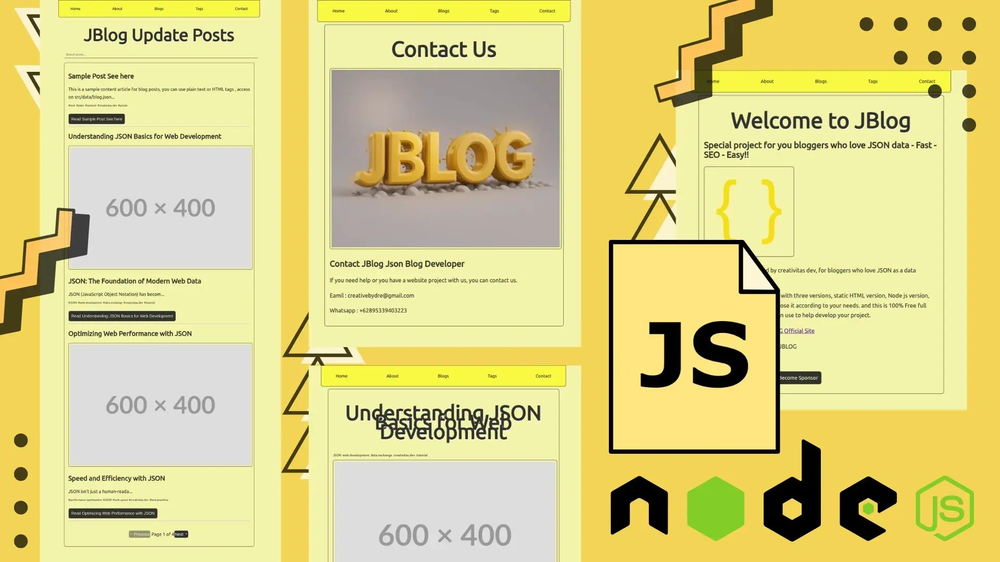

# JBLOG



Simplify blogging with JSON data - For JSON Blogger lovers!!

Demo and Documentation: [https://jblog.axcora.com](https://jblog.axcora.com)

All JBlog Version Package

[Download HTML Version](https://creativitaz.gumroad.com/l/jblog-html) | [Download PHP Version](https://creativitaz.gumroad.com/l/jblog-html)

Node Version run `npx jblog-x`

---

### Support Us

[🚀 Become a Sponsor](https://github.com/sponsors/mesinkasir) | [☕ Buy me Coffee](https://www.paypal.com/cgi-bin/webscr?cmd=_s-xclick&hosted_button_id=JVZVXBC4N9DAN) |  [🍩 Buy me a Donuts](https://creativitaz.gumroad.com/coffee)

---

## Features

+ Single Page App
+ Static Page
+ Dynamic Blog List
+ Blog Pagination
+ Article Page
+ Article Pagination
+ Tags
+ Search Functional
+ Auto SEO
+ Metatag
+ Open Graph
+ Twitter Card

---

## Installation

Run installation JBLOG

```
npx jblog-x
```

Or you can create new folder for your project name

```
npx jblog-x myproject
```

Next you can open your project folder

```
cd myproject
```

For first we need to build projects

```
npm run build
```

Run project

```
npm start
```

Open `localhost:7000`

Build for production mode

```
npm run build
```

Test Run Server

```
npm run server
```

---

## Deploy

Run build Production

```
npm run build
```

Upload `dist` folder in to your host

---

Documentation: [https://jblog.axcora.com](https://jblog.axcora.com)

All JBlog Version Package

[Download HTML Version](https://creativitaz.gumroad.com/l/jblog-html) | [Download PHP Version](https://creativitaz.gumroad.com/l/jblog-html)

Node Version run `npx jblog-x`

---

### [🚀 Become a Sponsor](https://github.com/sponsors/mesinkasir) | [☕ Buy me Coffee](https://www.paypal.com/cgi-bin/webscr?cmd=_s-xclick&hosted_button_id=JVZVXBC4N9DAN) |  [🍩 Buy me a Donuts](https://creativitaz.gumroad.com/coffee)

